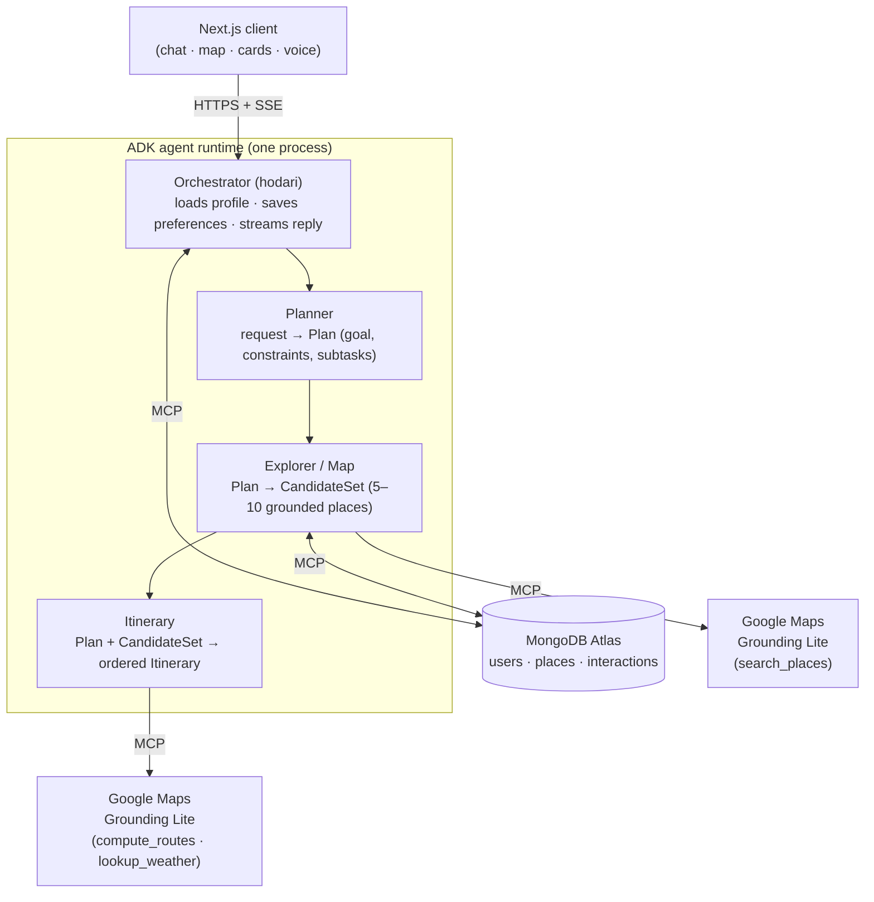

# Hodari

**A multi-agent tourist AI assistant for the 2026 FIFA World Cup.** Hodari helps football fans plan grounded, personalized itineraries — *"4 hours, $60, vegetarian near Camp Nou"* — through a conversational interface backed by real Google Maps data, and renders them on an interactive map with feasible walking routes.

> Hodari (Swahili: *brave / capable*) turns a fan's free time between matches into a concrete plan: where to eat, what to see, and how to get there.

---

## What it does

- **Conversational planning** — describe your time, budget, dietary needs, and location in plain language; Hodari streams back a friendly, structured plan.
- **Grounded place search** — candidates come from Google Maps (via the Maps Grounding Lite MCP), so places, ratings, and coordinates are real, not hallucinated.
- **Feasible itineraries** — stops are ordered to minimize walking, with real route distances/durations and polylines drawn on the map.
- **Weather-aware** — the itinerary agent checks conditions and nudges toward indoor/shaded venues when it matters.
- **Personalization** — thumbs-up/down and visit signals are stored per user and used to re-rank future suggestions.
- **Interactive map UI** — custom pins, route overlays, expandable place cards, and per-place follow-up chat ("Tell me more", "Why this stop?").
- **Push-to-talk voice**, **dark/light themes**, and a **PWA** install target.

---

## Architecture

Four agents, run **in a single process** with in-process routing (not four services). The Orchestrator owns session state and streams the final answer to the client over SSE.



**Inter-agent contracts** are Pydantic schemas, validated with one retry on malformed output: `Plan` → `CandidateSet` → `Itinerary` (see `agents/hodari/schemas/contracts.py`).

| Agent | Input | Output | Tools |
|---|---|---|---|
| **Orchestrator** | user message + profile + history | streamed natural-language reply | `load_user_profile`, `save_preference` (MongoDB MCP) |
| **Planner** | request + profile | `Plan` | none (pure reasoning) |
| **Explorer / Map** | `Plan` | `CandidateSet` | `search_places` (Maps MCP), `find_similar_preferences` / vector lookup (Mongo) |
| **Itinerary** | `Plan` + `CandidateSet` | `Itinerary` | `compute_routes`, `lookup_weather` (Maps MCP) |

---

## Tech stack

| Layer | Technology |
|---|---|
| Frontend | Next.js 15 (App Router), React 18, Tailwind CSS, PWA |
| Map UI | Google Maps JavaScript API via `@vis.gl/react-google-maps` |
| Agent runtime | Python 3.12, Google Agent Development Kit (ADK) |
| LLM | Gemini 3.5 Flash via Vertex AI |
| Database | MongoDB Atlas (`users`, `places`, `interactions`) |
| DB access | MongoDB MCP Server (no direct driver) |
| Maps grounding | Maps Grounding Lite MCP (`https://mapstools.googleapis.com/mcp`) |
| Schemas | Pydantic |
| Deployment | Google Cloud Run (Dockerized agents), Vercel/Cloud Run (client) |

---

## Repository structure

```
Map_Me/
├── agents/                     # Python agent backend (ADK)
│   ├── hodari/
│   │   ├── agent.py            # Orchestrator + SequentialAgent pipeline
│   │   ├── sub_agents/         # planner.py · explorer.py · itinerary.py
│   │   ├── tools/              # maps_mcp.py · mongo_tools.py · places_tools.py
│   │   └── schemas/            # contracts.py (Plan, CandidateSet, Itinerary)
│   ├── scripts/                # seed_places.py, create_indexes.py (Phase 2)
│   ├── services/               # remote_pipeline.py (per-service Cloud Run variant)
│   ├── tests/                  # pytest: contracts, mongo tools
│   ├── requirements.txt
│   ├── Dockerfile
│   └── .env.example
├── client/                     # Next.js frontend
│   ├── app/                    # page.tsx, layout, api/ (chat · session · feedback)
│   ├── components/             # ChatPanel · MapView · ItineraryStack · VoiceButton · ModelSwitcher
│   ├── lib/                    # types.ts · stream.ts · text.ts
│   └── .env.local.example
├── Hodari_System_Architecture.md   # full design spec
└── CLAUDE.md                   # working notes & conventions
```

---

## Prerequisites

- **Node.js** 18+ and npm
- **Python 3.12** (official CPython — MSYS2/MinGW Python lacks `pydantic-core` wheels)
- **MongoDB Atlas** cluster + connection string
- **Google Cloud project** with these APIs enabled:
  - Vertex AI API (for Gemini)
  - Maps Grounding Lite API (backend grounding)
  - Maps JavaScript API + Places API (frontend map)
- **gcloud CLI** (for local Vertex auth) — `winget install Google.CloudSDK`

---

## Setup (one-time)

**1. Clone and configure environment files**

```bash
# Backend
cp agents/.env.example agents/.env            # then fill in the values

# Frontend
cp client/.env.local.example client/.env.local # then fill in the values
```

**2. Backend: create the virtualenv and install deps**

```bash
cd agents
py -3.12 -m venv .venv                         # Windows: use the py launcher
# Activate — Windows PowerShell:
.\.venv\Scripts\Activate.ps1
# Activate — macOS/Linux:
source .venv/bin/activate

pip install -r requirements.txt
```

**3. Frontend: install deps**

```bash
cd client
npm install
```

**4. Authenticate to Vertex AI** (one-time; the agents use ADC, not an API key)

```bash
gcloud auth application-default login
```

### Environment variables

**`agents/.env`**

| Variable | Purpose |
|---|---|
| `GOOGLE_GENAI_USE_VERTEXAI` | `TRUE` — route Gemini through Vertex AI |
| `GOOGLE_CLOUD_PROJECT` | your GCP project **ID** |
| `GOOGLE_CLOUD_LOCATION` | `global` — required; Gemini 3.x is served only from the global Vertex endpoint (regional endpoints like `us-central1` return 404) |
| `GEMINI_MODEL` | `gemini-3.5-flash` |
| `GOOGLE_MAPS_API_KEY` | backend key, restricted to Maps Grounding Lite |
| `MONGODB_URI` | Atlas connection string |
| `MONGODB_DATABASE` | `hodari` |
| `MONGODB_MCP_URL` | `http://localhost:3100/mcp` |

**`client/.env.local`**

| Variable | Purpose |
|---|---|
| `NEXT_PUBLIC_GOOGLE_MAPS_API_KEY` | frontend key (Maps JS API + Places); referrer-restrict to `localhost:3000/*` |
| `ADK_BASE_URL` | `http://localhost:8000` |
| `ADK_APP_NAME` | `hodari` |

---

## Running locally

Hodari runs as **three processes**, each in its own terminal. Start them **in order** — later ones depend on earlier ones.

```
:3100  MongoDB MCP server   →  :8000  ADK agents API   →  :3000  Next.js client
```

**Terminal 1 — MongoDB MCP server** (uses your `MONGODB_URI`):

```bash
# macOS/Linux
MDB_MCP_CONNECTION_STRING="<your Atlas URI>" npx mongodb-mcp-server --transport http --httpPort=3100
```
```powershell
# Windows PowerShell
$env:MDB_MCP_CONNECTION_STRING="<your Atlas URI>"; npx mongodb-mcp-server --transport http --httpPort=3100
```

**Terminal 2 — ADK agents API:**

```bash
cd agents
# macOS/Linux (venv activated):
adk api_server hodari
# Windows — call the venv's adk.exe directly (a global adk can shadow it and fail to load `mcp`):
.\.venv\Scripts\adk.exe api_server hodari
```

**Terminal 3 — Next.js client:**

```bash
cd client
npm run dev
```

Then open **http://localhost:3000** and try: *"4 hrs, $60, vegetarian near Camp Nou"*.

> **Verify:** `curl http://localhost:8000/list-apps` should return `["hodari"]`.
>
> **Frontend-only loop:** to work on UI without the agent stack, run just Terminal 3 — the page renders, but chat won't get real replies until `:8000` is up.

### Other commands

```bash
# Agent-testing web UI (instead of the API server)
.\.venv\Scripts\adk.exe web hodari

# Frontend
npm run build        # production build
npm run lint

# Backend tests
cd agents && pytest
```

---

## Build phasing

The repo is built **MVP-first**: prove the grounded loop before adding cost/complexity.

- **MVP** — Orchestrator → Explorer (`search_places`) → Itinerary (`compute_routes`), all in one process. Personalization re-ranks Maps candidates against the `interactions` history.
- **Phase 2** — vectorized `places` collection + Atlas Vector Search, per-agent Cloud Run services, weather-driven itineraries. The `agents/scripts/` seeders and `agents/services/` support this.

See [`Hodari_System_Architecture.md`](./Hodari_System_Architecture.md) for the full spec.

---

## Deployment

Agents are containerized (`agents/Dockerfile`) and deploy to **Google Cloud Run**; the frontend deploys to **Vercel** or Cloud Run behind a CDN. In production, Gemini authenticates via Vertex AI + a service account, and secrets live in Google Secret Manager.

---

## Out of scope (MVP)

Booking/payments, email, calendar sync, OAuth integrations, and multilingual support are intentionally deferred.
